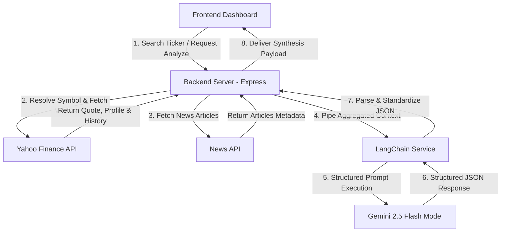
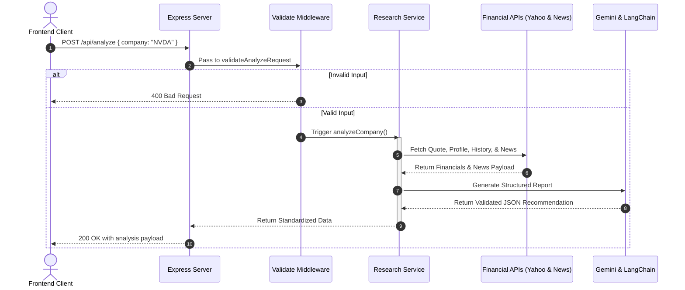
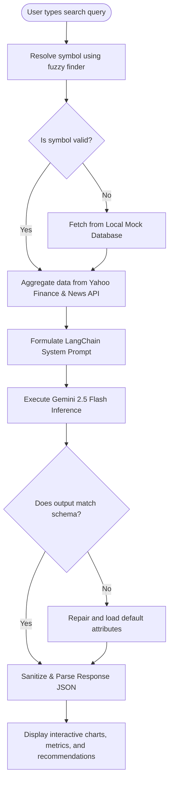

# 🤖 AI Investment Research Agent

<p align="center">
  
  
  
  
  
  
</p>

<p align="center">
  <b>An institutional-grade, AI-driven quantitative investment analysis application.</b><br/>
  Synthesizes live market metrics, historical data, and news sentiment vectors using LangChain and Gemini to construct auditable buy/hold/sell recommendations.
</p>

<p align="center">
  <a href="#-installation--setup"><b>Setup Guide</b></a> •
  <a href="#-architecture"><b>Architecture</b></a> •
  <a href="#-api-endpoints"><b>API Endpoints</b></a> •
  <a href="#-faq"><b>FAQ</b></a>
</p>

---

## 🔍 Overview

The **AI Investment Research Agent** is a full-stack, recruiter-ready platform built for the **InsideIIM × Altuni AI Labs AI Product Development Engineer Internship** assignment. It bridges the gap between raw quantitative data and qualitative market sentiment. 

By querying real-time ticker data, balance sheet multiples, and live press releases, the agent pipes high-density context into a structured LangChain + Gemini LLM chain. The result is a comprehensive, institutional-grade equity analysis dashboard featuring responsive charts, news sentiment cards, and clear audit timelines.

---

## ✨ Features

*   **🔍 Company Search & Auto-Resolver:** Matches natural language company names (e.g., "Apple") to ticker symbols (`AAPL`) using live search API queries and fuzzy local dictionaries.
*   **📈 Financial Metrics Dashboard:** Extracts and displays crucial metrics including Market Cap, P/E Ratio, Dividend Yield, EPS, Net Profit Margins, and Debt-to-Equity.
*   **📊 Interactive Price Charts:** Interactive SVG chart rendering the past 30 days of market close coordinates using **Recharts**.
*   **📰 Sentiment & News Matrix:** Automatically crawls live news, evaluates individual article sentiment (Bullish, Bearish, Neutral), and generates concise impact summaries.
*   **🛡️ Risk & Future Outlook Scans:** Professional-grade assessments of balance sheet health, regulatory exposure, and estimated 1–5 year valuation trajectories.
*   **🎯 Score Gauge & Recommendation:** Outputs explicit ratings (Buy, Hold, Sell) coupled with a dynamic confidence percentage score.
*   **⏳ Thinking Timeline:** A step-by-step audit tracker rendering the active execution phases of the LLM pipeline in real-time.
*   **🎨 Glassmorphic Dark UI:** Premium aesthetic featuring responsive layouts, glowing gradients, and fluid micro-animations built using **Tailwind CSS v4** and **Framer Motion**.
*   **⚠️ Resilience & Failover:** Graceful error handling and visual skeletons that sustain operation even during third-party API rate limits.

---

## 🏗️ Architecture

The application is structured as a decoupled monorepo (Vite Frontend & Express Backend) interacting with financial data streams and AI reasoning runtimes.

### System Architecture Flow


### API Request Flow Sequence


### Project Analysis Workflow


---

## 📁 Folder Structure

```text
ai-investment-research-agent/
├── backend/                  # Node.js/Express Server
│   ├── config/               # Status codes, constants, env loader
│   ├── controllers/          # Request handlers
│   ├── middleware/           # Pipeline filters, validator, error logger
│   ├── routes/               # Routing endpoints
│   ├── services/             # Core logic (AI, company metadata, news, fallback data)
│   ├── utils/                # Operational error handlers
│   ├── .env                  # Backend port & API keys
│   └── server.js             # Entrypoint
│
└── frontend/                 # Vite/React Frontend App
    ├── public/               # Static assets & placeholders
    ├── src/                  # React source files
    │   ├── assets/           # Media components
    │   ├── components/       # Reusable layout & visual elements (charts, cards, badges)
    │   ├── pages/            # View containers (Home, Dashboard, NotFound)
    │   ├── utils/            # Mock stock data and utility functions
    │   └── main.jsx          # React app DOM mounting point
    └── vite.config.js        # Compile rules
```

---

## 📸 Demo & Screenshots

### Live Demo Links
*   🌐 **Frontend URL:** [https://ai-investment-research-agent-ashy.vercel.app/]
*   ⚙️ **Backend API URL:** [https://ai-investment-research-backend.onrender.com]

---

## ⚙️ Installation & Setup

### Prerequisites
- [Node.js](https://nodejs.org/) (v18.x+) and [npm](https://www.npmjs.com/) (v9.x+)

### 1. Configure the Backend Server
```bash
cd backend
npm install
```
Create a `.env` file in the `backend/` directory:
```env
PORT=5000
NODE_ENV=development
GEMINI_API_KEY=your_gemini_api_key
NEWS_API_KEY=your_news_api_key
```
Run the server:
```bash
npm run dev
```

### 2. Configure the Frontend App
```bash
cd ../frontend
npm install
```
Create a `.env` file in the `frontend/` directory:
```env
VITE_API_URL=http://localhost:5000/api
```
Start the development server:
```bash
npm run dev
```

---

## 🔌 API Endpoints

*   `GET /` - Root diagnostic check (validates server state).
*   `GET /api/health` - Diagnostic health check returning `{"status": "Healthy"}`.
*   `POST /api/analyze` - Research analyzer endpoint.
    - **Request Body:** `{ "company": "NVDA" }`
    - **Headers:** `Content-Type: application/json`

---

## 🌐 Deployment Guide

### Backend Deployment (Render / Heroku)
1. Set up a Web Service on Render linked to your repository.
2. In the Render Dashboard, navigate to **Environment Variables** and add:
   - `NODE_ENV=production`
   - `GEMINI_API_KEY` & `NEWS_API_KEY`
3. Set the **Build Command** to `cd backend && npm install` and the **Start Command** to `cd backend && node server.js`.

### Frontend Deployment (Vercel / Netlify)
1. Connect your repository to Vercel.
2. Configure **Environment Variables** under Project Settings:
   - `VITE_API_URL` (Points to your live deployed backend URL).
3. Set the **Root Directory** to `frontend`. Vercel automatically runs `npm run build` and serves the `dist/` directory.

---

## ❓ FAQ

**Q: Can the application run if my NewsAPI key is not active?**  
**A:** Yes. The application implements automatic fallback scrapers inside [`newsService.js`](file:///c:/Users/HP/OneDrive/Desktop/ai-investment-research-agent/backend/services/newsService.js). If NewsAPI returns an error or is unconfigured, the system automatically fetches related headlines from Yahoo Finance search API and falls back to generalized market news.

**Q: How does the application ensure the Gemini response is structured?**  
**A:** We use LangChain's Prompt templates coupled with ChatGoogleGenerativeAI's configuration flag `json: true`. This forces Gemini to output structural JSON matching our schema, which is then parsed and verified by [`aiService.js`](file:///c:/Users/HP/OneDrive/Desktop/ai-investment-research-agent/backend/services/aiService.js).

---

## 🤝 Contributing

Contributions are welcome! Follow these steps to submit your changes:
1. Fork the Project.
2. Create your Feature Branch (`git checkout -b feature/AmazingFeature`).
3. Commit your Changes (`git commit -m 'Add some AmazingFeature'`).
4. Push to the Branch (`git push origin feature/AmazingFeature`).
5. Open a Pull Request.

---

## 📜 License

Distributed under the MIT License. See [LICENSE](file:///c:/Users/HP/OneDrive/Desktop/ai-investment-research-agent/LICENSE) for more details.

---

## 💖 Acknowledgements

*   [Yahoo Finance Node](https://github.com/gadicc/node-yahoo-finance2) for underlying stock data structures.
*   [LangChain JS/TS](https://github.com/langchain-ai/langchainjs) for LLM orchestration wrappers.
*   [Google Generative AI](https://ai.google.dev/) for powering the analysis engine.
*   [InsideIIM × Altuni AI Labs](https://insideiim.com/) for organizing this development internship assignment.

---

## 🤖 AI Usage Disclosure

During development, AI systems—specifically **Antigravity** and **Gemini**—were used for code generation, UI styling, debugging, and suggestions. All generated code was manually reviewed, refined, and integrated by the author.

---

## ✍️ Author

Created by **Trishya Nigam**

[](https://github.com/trishyanigam)
[](https://www.linkedin.com/in/trishya-nigam/)
